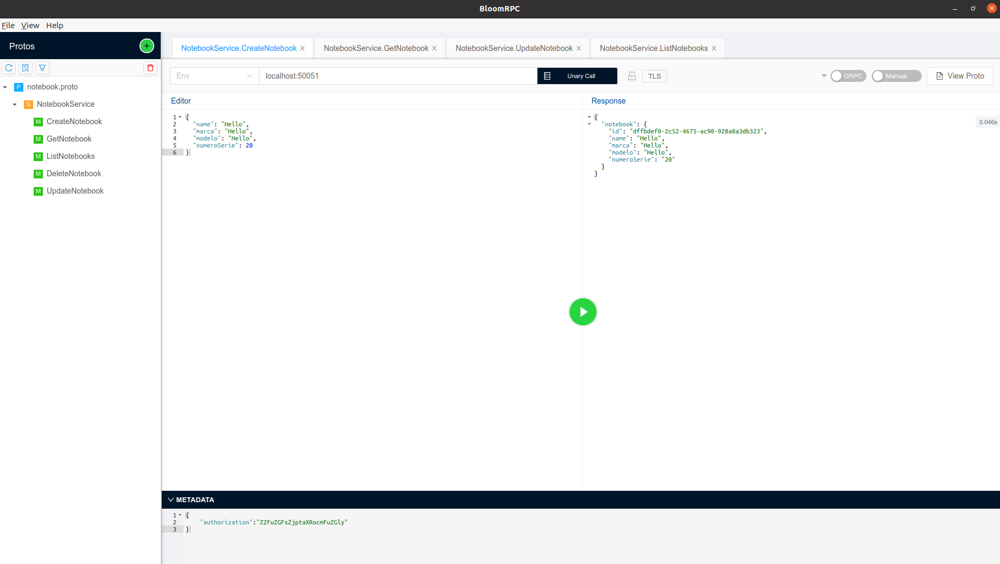

# poc_grpc

An API gRPC service example with observability features as custom logs, Jaeger and NATS(TODO). (TODO login with keycloak)

## 🧰 Configuration
To install bloomRPC:
``` powershell
git clone https://github.com/uw-labs/bloomrpc.git
cd bloomrpc

yarn install && ./node_modules/.bin/electron-rebuild
npm run package
```
To start application:
``` powershell
make run-server-grpc
```

## 🛠 How to use

Import notebook.proto and login.proto and make requests to localhost:50051 with metadata:
``` powershell
authorization":"Z2FuZGFsZjptaXRocmFuZGly
```
